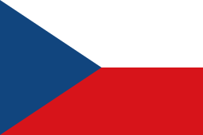

# Memory card with text paragraphs

This is the first paragraph. It will become the second page of the card
(first one is the header itself).

This is the second paragraph. It is separated from the first one by an empty line.
It will become the third page of the card.

It is possible to *emphasize* text using standard Markdown notation.

# Memory card with some text and bullets

This is an explanatory text. It will become page 2 of the card.

- Bullets are ignored in this case
- regardless of their type

* Line dividers are also ignored
* Term: This is the definition

# This header won't show as a card, see explanation below

## Explanation

There needs to be at lease some content after a header in order for it
to be considered a flashcard. Flashcard simply needs to have at least
two pages, otherwise what's the point? ;)

### Third level header

Any header can start a new card. This one demonstrates how
the first and second level headers are both shown on the flashcard.

### Using spaces

Markdown makes use  
of trailing spaces.
 
Putting two spaces at the end of a line  
serves as a line break within a paragraph.
 
You can also use it to prevent an empty line from being a card page break.
Just put a single space on it and it will be ignored.
 
Make sure to set the `files.trimTrailingWhitespace` setting to `false`.

# Rich content - tables, images

## Preterite: estar

|Singular|Plural|
|-|-|
|est*uve* |est*uvi*mos|+
|est*uvi*ste |est*uvi*steis|
|est*uvo* |est*uvie*ron|

## Whose flag is this?


Answer: Czech Republic

Note: Since there is no empty line between the header and the image, the image will appear on the first page of the card.

## Network images


Lena Soderberg

# Code

## Hello World JS

```javascript
const http = require('http');

const hostname = '127.0.0.1';
const port = 3000;

const server = http.createServer((req, res) => {
  res.statusCode = 200;
  res.setHeader('Content-Type', 'text/plain');
  res.end('Hello World');
});

server.listen(port, hostname, () => {
  console.log(`Server running at http://${hostname}:${port}/`);
});
```